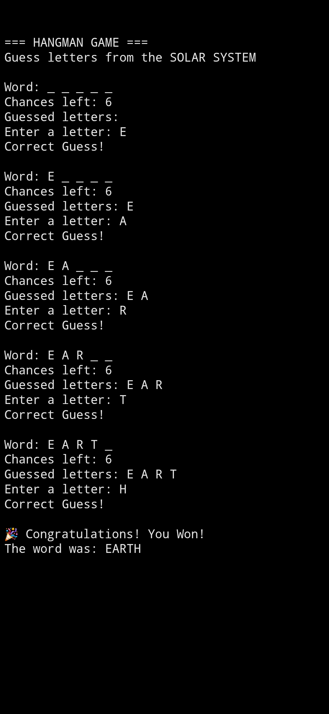

# Hangman-_game-

This is a simple Hangman Game made using Python.

## Features
- Random word selection
- Letter guessing
- Limited chances
- Win and lose conditions

## Technologies Used
- Python

## How to Run
1. Open the project
2. Run the Python file
3. Guess the letters to find the word

## Author
Anushka Singh

## Screenshot

